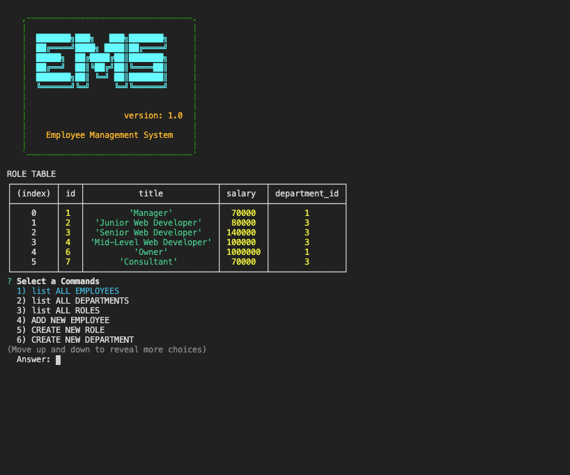
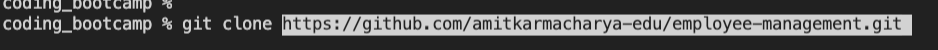

# Employee Management System

Employee management system is a cli app that lets you track your existing employees and adding new employees. You can view departments, roles and make necessary changes.

The goal of this app is to architect and build a solution for managing a company's employees using node, inquirer, and MySQL.The app allows the user to:

  * Add departments, roles, employees

  * View departments, roles, employees

  * Update employee roles

  * Update employee managers

  * View employees by manager

  * Delete departments, roles, and employees

  * View the total utilized budget of a department

 

### Table of Contents

- [Snapshot](#snapshot)
- [Technologies](#technologies)
- [Installation](#installation)
- [References](#references)
- [License](#license)
- [Author](#author-info)

---

 

## Snapshot

---

 

## Technologies

- JavaScript
- NPM Modules
- Visual Studio Code
- Node.js
- Inquirer (package)
- MySQL

---

 

## Installation

The following steps listed below will help guide you through the installation proces.
  
- Node.js

  To Install node.js [click here](https://nodejs.org/en/download/)

- Clone the repository. 

    

- Inside the root folder execute the following command

    

- Execute command 

    

---

 

## References

- w3school -- [Node.js NPM](https://www.w3schools.com/nodejs/nodejs_npm.asp)
- NPM -- [Node Package Managment](https://www.npmjs.com/)
- Inquirer -- [Inquirer module](https://www.npmjs.com/package/inquirer)
- Node.js -- [About Node.js](https://nodejs.org/en/)
- json -- [The package.json guide](https://nodejs.dev/learn/the-package-json-guide)
- Mysql -- [Mysql module](https://www.npmjs.com/package/mysql)
- console.table -- [console.table module](https://www.npmjs.com/package/console.table)

[Back To The Top](#Employee_Tracker)

---
 

## License

---

 

## Author

- Linkedin -- [Amit Karmacharya](https://www.linkedin.com/in/amit-karmacharya-b344731ab/)
